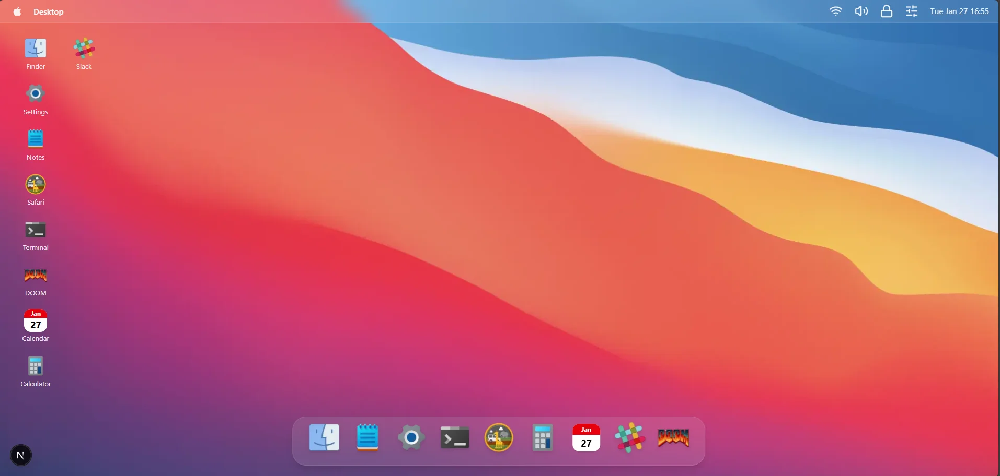

# MacOS-like Web Desktop 🖥️

A macOS-inspired desktop interface built for the web, featuring a custom Finder, Dock, window manager, and a virtual file system.  
This project explores how desktop operating system UX patterns can be translated into a modern React / Next.js architecture.

Live demo: https://escapegame.gabriaile.dev

---

## Features

- **Finder-like file explorer**
  - Grid & list views
  - Sidebar navigation (Applications, Documents, Downloads, etc.)
  - File & folder selection
  - Double-click to open folders or launch apps
  - Global search across the entire virtual file system

- **Virtual File System (in-memory)**
  - Directories, files, and applications as first-class nodes
  - Recursive search
  - Type-safe architecture (TypeScript)

- **Window & App management**
  - Applications launched from Finder
  - Centralized app registry
  - Multiple app windows
  - Focus & state handling
    
- **Experimental apps**
  - **DOOM** running inside a window, as a proof-of-concept for embedding non-trivial applications
---

## Tech stack

- **Next.js** (App Router)
- **React**
- **TypeScript**
- **Tailwind CSS**
- **Framer Motion**
- **Zustand** (state management)

---

## Architecture overview

- **`core/fs`**
  - Virtual file system (directories, files, apps)
  - Path resolution & recursive search

- **`core/apps`**
  - Central app registry
  - App metadata (id, title, icon, component)

- **`store`**
  - Desktop state (windows, current directory, focus, history)

- **`components/apps`**
  - Finder, apps, and UI building blocks

The architecture is designed to be:
- scalable
- type-safe
- close to real OS concepts (Finder, Applications, Dock, Spotlight)

---
## Developer tooling

This project includes a **Docker-based setup** and a **Makefile** to streamline development and production workflows.
### Available Make commands

```bash
make

# Development
make dev        # Start dev container with hot reload
make dev-d      # Start dev container in background
make dev-stop   # Stop dev container
make dev-logs   # Show dev logs
make dev-shell  # Open a shell inside the dev container

# Testing
make test       # Run tests in UI mode
make test-head  # Run tests in headless mode

# Production
make prod           # Start production containers
make prod-stop      # Stop production containers
make prod-restart   # Restart production containers
make prod-logs      # Show production logs
make prod-shell     # Open a shell inside the prod container

# Utilities
make status     # Show Docker containers status
make logs       # Show logs (prod by default)
make clean      # Clean Docker system
```
---

## Motivation

This project was created as an experimental playground to:
- explore complex UI state management
- reproduce desktop OS interaction patterns in the browser
- design a clean, extensible frontend architecture
- push beyond typical CRUD-style web applications

It is intentionally **not backed by a real filesystem or backend**, allowing full control over behavior and UX experimentation.

---

## Screenshots



---

## Author

**Gabriel Filiot**  
Full stack developer

France / Germany  
Portfolio: https://gabriaile.dev  
GitHub: https://github.com/gabgabb  

This project was fully designed and developed by me as a macOS-inspired frontend experiment.

---
